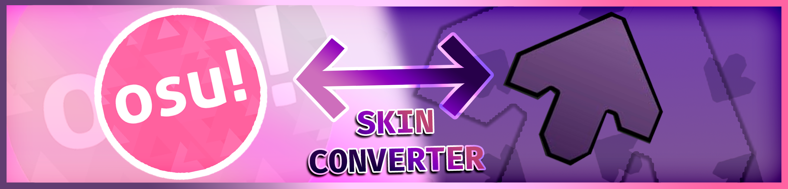

<p align="center">
  
</p>

# 🎹 VSRG Skin Converter

<p align="center">
  <em>Convert vertical-scrolling rhythm-game skins between Etterna and osu!mania.</em>
</p>

<p align="center">
  <a href="https://github.com/Stefany-Campanhoni/vsrg-skin-converter/releases/latest">
    
  </a>
  <a href="https://github.com/Stefany-Campanhoni/vsrg-skin-converter/actions/workflows/ci.yml">
    
  </a>
  <a href="LICENSE">
    
  </a>
</p>

VSRG Skin Converter is a small interactive CLI that migrates supported settings and artwork
between Etterna and osu!mania. It leaves the source skin untouched and publishes the complete
target as one recoverable operation.

If the converter saves you time, you can help fund maintenance and support for more formats
through [Buy Me a Coffee](https://buymeacoffee.com/tefyyay).

<p align="center">
  <a href="https://buymeacoffee.com/tefyyay">
    
  </a>
</p>

> The supported portable build targets Windows x64, and currently supports 4K skins only.

## Table of contents

- [Download and run](#download-and-run)
- [How to use it](#how-to-use-it)
- [Run from source](#run-from-source)
- [License and template assets](#license-and-template-assets)

## Download and run

1. Open the [latest GitHub release](https://github.com/Stefany-Campanhoni/vsrg-skin-converter/releases/latest).
2. Download the Windows x64 ZIP and its adjacent `.sha256` file.
3. Verify that the archive hash matches the checksum file.
4. Extract the complete top-level directory.
5. Run `vsrg-skin-converter.cmd`.

You can verify the download in PowerShell:

```powershell
Get-FileHash .\vsrg-skin-converter-v<version>-win-x64.zip -Algorithm SHA256
Get-Content .\vsrg-skin-converter-v<version>-win-x64.zip.sha256
```

The two hashes must match. Keep `app.mjs`, `runtime`, `node_modules`, and `templates` beside
the launcher. The portable package already includes Node.js and npm.

The portable build is not an installer, is not currently code-signed, and does not update
itself. Windows ARM64, Linux, and macOS are not supported.

## How to use it

1. Start `vsrg-skin-converter.cmd`.
2. Choose the source game.
3. Select the source profile, configuration, and skin when prompted.
4. Choose an installation folder if the default installation is not found.
5. Review the exact target and confirm before replacing an existing skin.
6. Wait for the success message, then open the target game.

For **Etterna to osu!mania**, the converter reads the selected Etterna NoteSkin and local
profile, installs the converted skin under osu!'s `Skins` directory, and updates the current
Windows user's `ManiaSpeed`. Start osu! at least once before converting so that its user
configuration exists.

For **osu!mania to Etterna**, the converter reads the selected osu! skin and user
configuration, installs a new Etterna NoteSkin, and creates a numbered local profile with the
converted settings.

The converter stages its output before changing any target. If conversion or installation
fails, it restores the previous files and removes incomplete output.

## Run from source

Requirements:

- Windows 10 or newer
- Node.js 22.18 or newer
- Etterna and osu!, depending on the conversion direction

Install the exact dependency tree and start the CLI:

```powershell
npm ci
npm start
```

Use `npm run dev` to restart automatically while editing. Add `--verbose` to include the
complete error stack:

```powershell
npm start -- --verbose
```

See [CONTRIBUTING.md](CONTRIBUTING.md) for development, testing, Changesets, and pull request
requirements.

## License and template assets

VSRG Skin Converter is licensed under the [GNU General Public License v3.0](LICENSE)
(`GPL-3.0-only`). Bundled templates are distributed with permission.

The project banner was created for VSRG Skin Converter by
[@akaneyt](https://www.youtube.com/@akaneyt) and is redistributed with the artist's permission.

The bundled osu!mania default judgement sheet is derived from the osu! legacy skin assets by
ppy Pty Ltd and distributed under
[CC BY-NC 4.0](https://github.com/ppy/osu-resources/blob/master/LICENCE.md).

For concerns about the licensing, attribution, or ownership of a bundled template or asset,
contact [scampanhoni@gmail.com](mailto:scampanhoni@gmail.com).
